# LashPop Admin owner guide

Use this guide when you need to complete a task in LashPop Admin. Search the in-app **Owner guide** for the easiest way to use these instructions.

## How this guide is written

This guide follows the GOV.UK approach to clear content: start with the task, use everyday words, write in the active voice and keep sentences short. Screenshots support the instructions, but the written steps contain everything you need.

- [Use clear language](https://guidance.publishing.service.gov.uk/writing-to-gov-uk-standards/writing-guidelines/clear-language/)
- [Identify user needs](https://guidance.publishing.service.gov.uk/writing-to-gov-uk-standards/plan-manage-content/identify-user-needs/)
- [Use the right tone](https://guidance.publishing.service.gov.uk/writing-to-gov-uk-standards/tone-of-voice/right-tone/)
- [Publish accessible documents](https://www.gov.uk/guidance/publishing-accessible-documents)

## Before you change anything

1. Open the page you plan to change in one browser tab.
2. Open the public website in another tab.
3. Make one clear change at a time.
4. Read every warning before you save.
5. Check the public result on a phone and computer.
6. Use Activity history or Website versions when you need to understand or undo an earlier change.

## Start here

<!-- capability:access-sign-in -->
### Sign in or sign out

Use your approved phone number to open LashPop Admin. Sign out when you finish on a shared device.

**Open:** Sign in

**Questions this guide answers**

- How do I sign in with my phone number?
- How do I sign out when I am finished?

> **Before you continue:** Never share a sign-in code. LashPop staff will not ask you to send one.

#### Before you start

- Use the phone number that has LashPop Admin access.
- Keep your phone nearby so you can receive the sign-in code.

#### Steps

1. **Enter your phone number.** Type the full phone number in the Phone number box.
2. **Ask for a code.** Select Send code. Wait for the text message before asking for another code.
3. **Enter the code.** Type the code from the text message. LashPop Admin opens on the Today page.
4. **Sign out when needed.** Open the account area at the bottom of the menu and select Sign out.

#### Check your work

- You can see the Today page after signing in.
- A signed-out browser returns to the sign-in page.

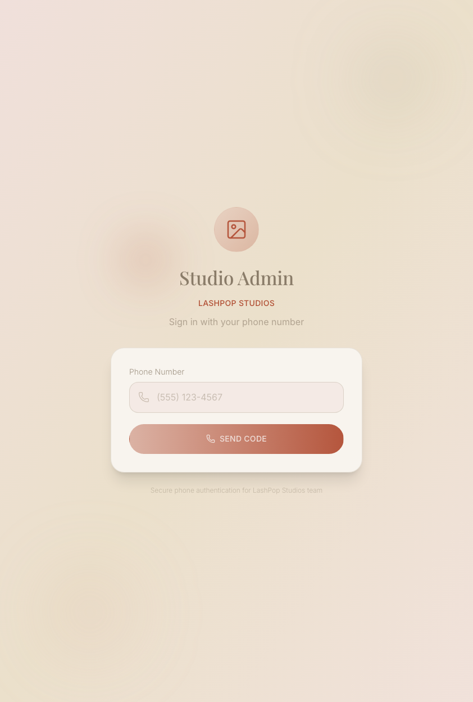

<!-- capability:today-overview -->
### Review today's Admin tasks

Start here to see newsletter signups, applications, recorded activity and the latest Vagaro update.

**Open:** Today → Admin overview

**Questions this guide answers**

- Where do I see today's Admin tasks?

#### Steps

1. **Open Today.** Select Today in the main menu.
2. **Check the latest Vagaro update.** If the update failed or is late, open Vagaro sync before publishing website changes.
3. **Check new activity.** Review newsletter signups, applications and recent activity.
4. **Open the work you need.** Select a card to go straight to that part of Admin.

#### Check your work

- You checked the latest Vagaro update.
- You opened each new signup or application that you need to review.

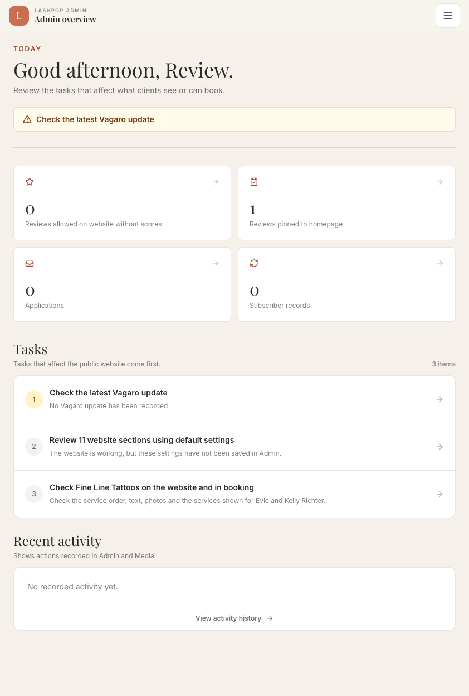

<!-- capability:website-performance -->
### Review website analytics

See how many people visited, which pages they viewed, where visits came from and which website actions were recorded.

**Open:** Today → Website analytics

**Questions this guide answers**

- How do I see visitors, page views, traffic sources and tracked website actions?

> **Before you continue:** Tracked booking starts count service selections, Find Your Look booking selections and Naturtox links. Vagaro submissions count requests and confirmations from the embedded form. Open Vagaro to see each submission's status.

#### Steps

1. **Open Website analytics.** Select Today, then Website analytics.
2. **Choose a time period.** Use 7, 30 or 90 days. Every comparison uses the same number of earlier days.
3. **Start with Overview.** Read visitors, page views, tracked booking starts and Vagaro booking submissions.
4. **Open each report.** Use Sources, Recorded actions and Pages to see where visits came from, which actions were recorded and what people viewed.
5. **Check the source record when needed.** Use Vagaro for final appointment records and Inbox for saved applications or newsletter signups. Every recorded action adds one to its total, including repeats.

#### Check your work

- The selected period matches the question you are asking.
- You know which source, tracked action or page to review next.

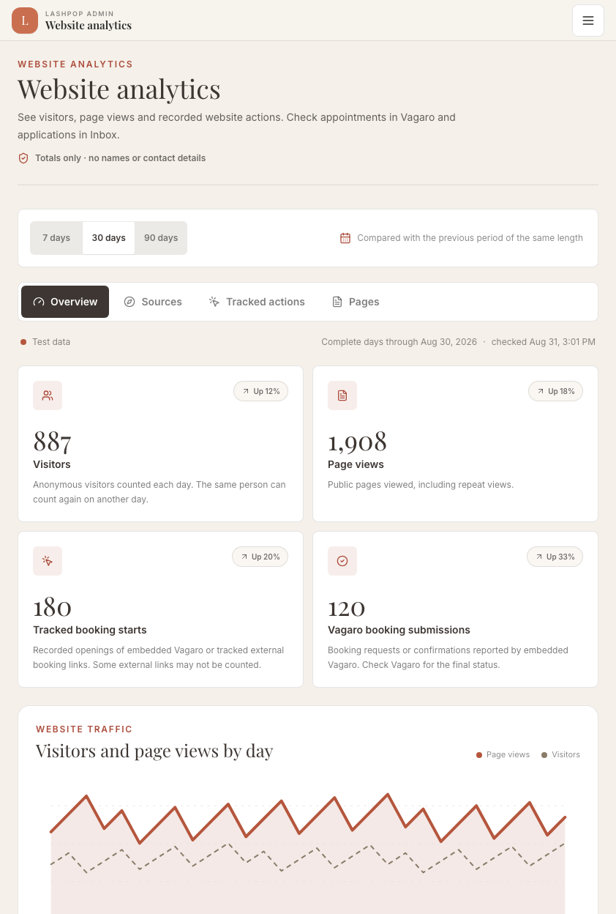

<!-- capability:owner-guide -->
### Find help in LashPop Admin

Search by the job you want to complete, or browse a work area.

**Open:** Owner guide

**Questions this guide answers**

- How do I find help in the admin panel?

#### Steps

1. **Open Owner guide.** Select Owner guide under Settings.
2. **Search for your task.** Type what you want to do, such as change a team photo or add a service.
3. **Choose a result.** Select the task that best matches what you need.
4. **Follow each step.** Use the numbered instructions and screenshot. Select Open this page when you are ready to work.

#### Check your work

- The guide shows a task that matches your search.
- The Open this page link takes you to the correct Admin screen.

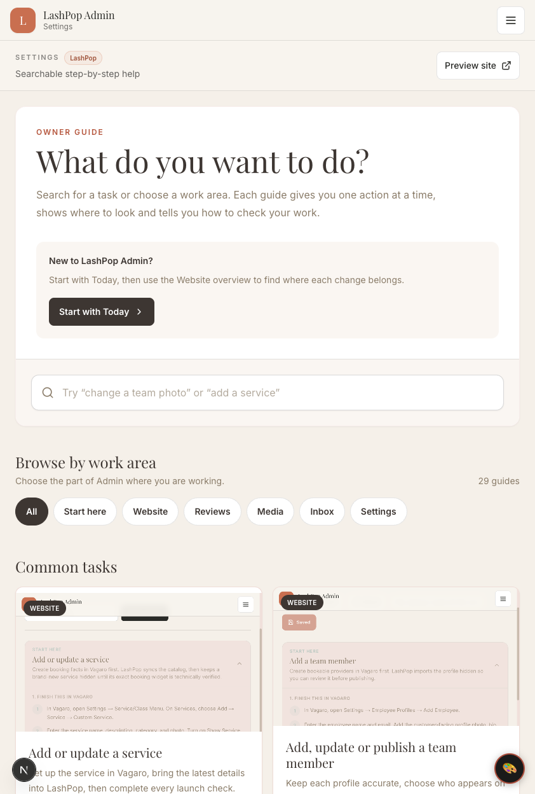

## Website

<!-- capability:website-overview -->
### Know where to make a website change

Use the Website overview to learn whether to make a change in Admin, Vagaro or both.

**Open:** Website → Website overview

**Questions this guide answers**

- Where do I see where each website change belongs?

#### Steps

1. **Open Website.** Select Website, then Website overview.
2. **Find the part you want to change.** Look for the card that matches the page or content.
3. **Read where the change belongs.** Edit here means use Admin. Edit in Vagaro means start in Vagaro. Updates automatically means the page explains the rules. Vagaro and Admin means both places are involved.
4. **Open the correct page.** Select the card to continue.

#### Check your work

- You know where to make the change.
- You have not entered the same change in two places.

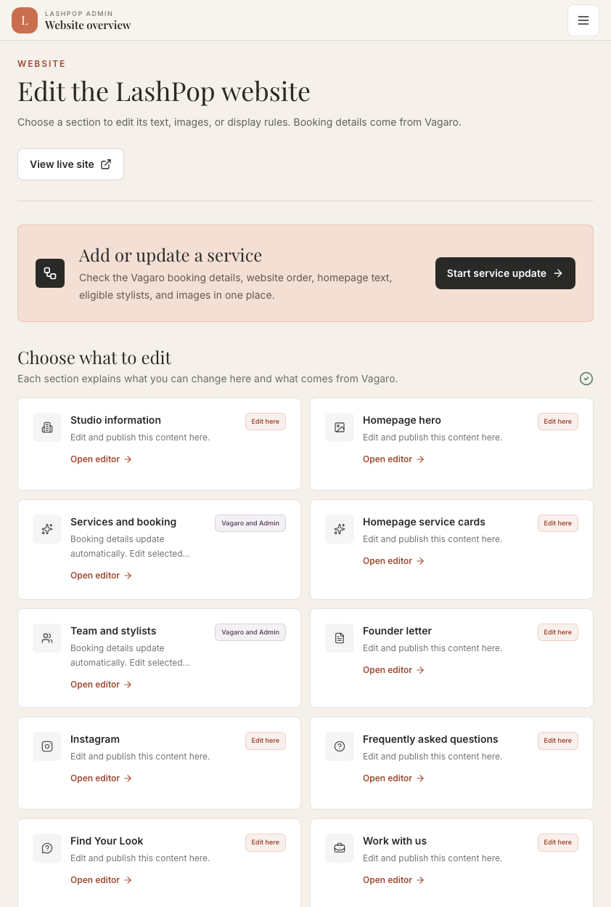

<!-- capability:service-launch -->
### Add or update a service

Set up the service in Vagaro, bring the latest details into LashPop, then complete every launch check.

**Open:** Website → Launch a service

**Questions this guide answers**

- How do I add or update a service in Vagaro, sync it, and know what the website manager still needs to finish?
- How do I check that a new or updated service is ready to publish?

> **Before you continue:** Do not copy another service's booking link. A wrong link can send customers to the wrong appointment.

#### Before you start

- Have the final service name, category, price, length and list of providers.
- Use a computer for the Vagaro setup.

#### Steps

1. **Set up the service in Vagaro.** In Vagaro, open Settings, then Service/Class Menu. Add or edit the service, turn on online booking and choose every provider who offers it. This step happens in Vagaro.
2. **Confirm the Vagaro work.** Return to LashPop. Read the checklist, tick the confirmation box and select Update from Vagaro now.
3. **Find the service.** Choose the service category and select Check service.
4. **Complete each launch check.** Review booking, wording, photos, homepage card and eligible team members. Open each incomplete item from the checklist.
5. **Ask for the booking connection.** For a brand-new service, send the exact service name and Vagaro category to the website manager. Keep it hidden until they confirm the booking button is ready.
6. **Test before showing it.** Open both customer links. Test the service page and booking path on a phone and computer.

#### Check your work

- The service opens the correct booking screen.
- Only the correct providers appear.
- The service wording, image and homepage card are correct.

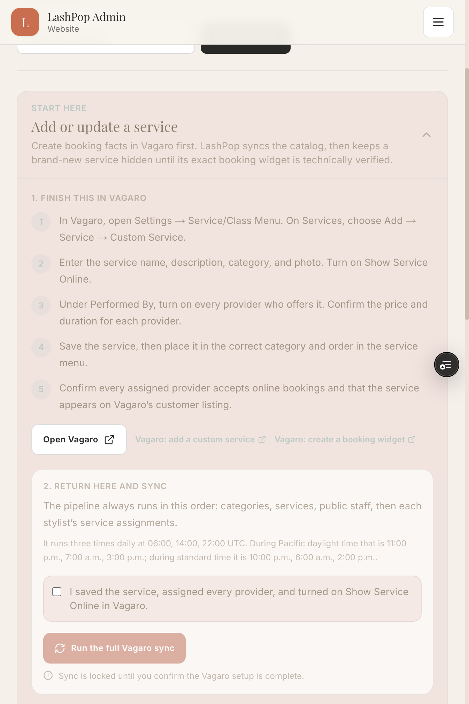

<!-- capability:studio-info -->
### Change studio contact details or hours

Change the details that appear in the footer, map, contact links and search results.

**Open:** Website → Studio information

**Questions this guide answers**

- How do I update the studio address, phone number, email, hours, booking link, map location, or social links?

#### Before you start

- Confirm the new details from an official source.
- Have full web addresses ready for booking and social links.

#### Steps

1. **Open Studio information.** Select Website, then Studio information.
2. **Change only what is different.** Review the address, phone, email, hours, booking link, map point and social links.
3. **Check links and map numbers.** Make sure every web address starts with https://. Check the map point carefully.
4. **Save the changes.** Select Save.
5. **Check the public site.** Open the footer, map and contact links on the website. Test them on a phone.

#### Check your work

- The footer shows the new details.
- Phone, email, map and booking links open correctly.
- The studio pin appears in the right place.

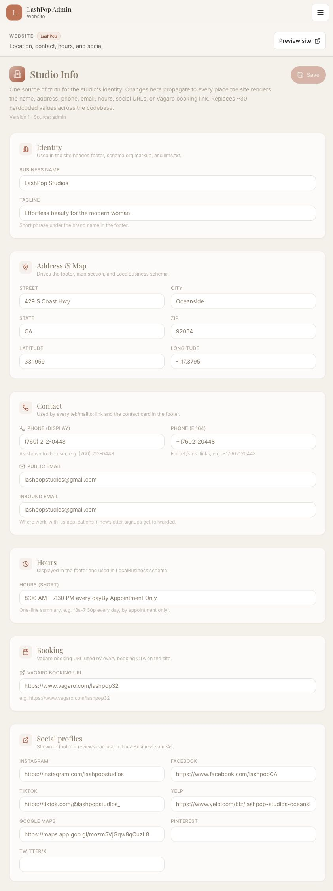

<!-- capability:homepage-hero -->
### Change the homepage headline or hero photos

Update the first words and photos people see when they open the website.

**Open:** Website → Homepage hero

**Questions this guide answers**

- How do I change the homepage headline or button labels?
- How do I choose the homepage hero photos and control the desktop and phone slideshow?

> **Before you continue:** The homepage hero affects every visitor. Check both screen sizes before you finish.

#### Before you start

- Have approved wording and high-quality photos ready.
- Check that each photo works in both a wide and tall space.

#### Steps

1. **Open Homepage hero.** Select Website, then Homepage hero.
2. **Update the words.** Change the headline, supporting line or button labels in Hero content.
3. **Choose the photos.** Open the slideshow settings. Add approved photos and place the main subject inside the safe area.
4. **Set phone and computer versions.** Choose which slideshow appears on each screen size. Use the same one only when every crop still looks good.
5. **Publish and check.** Save the settings. Open the homepage on a phone and computer and watch the full slideshow once.

#### Check your work

- The headline and buttons say exactly what you approved.
- Faces and important details are not cut off.
- The first photo appears quickly on a fresh page load.

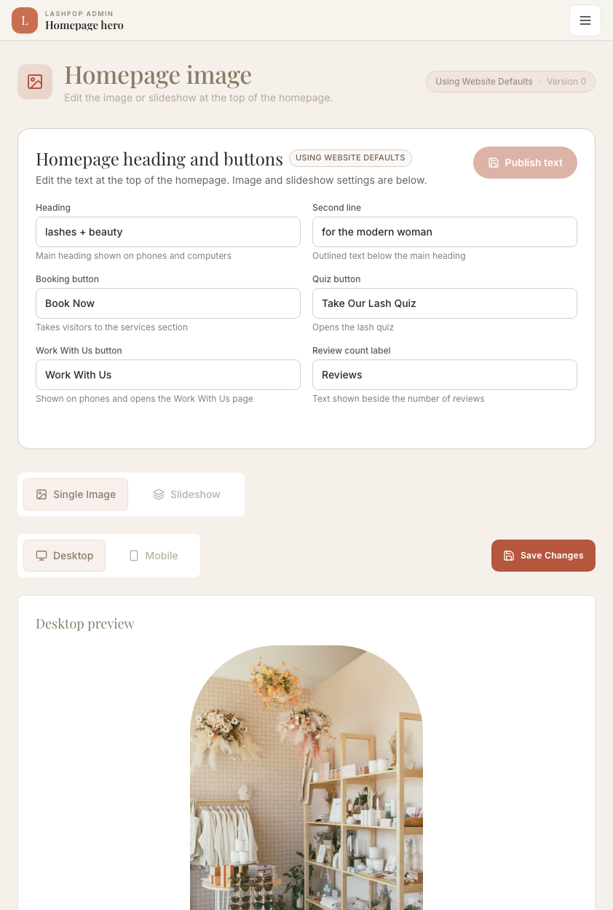

<!-- capability:services-booking -->
### Review services and booking

Review the service details copied from Vagaro and the way LashPop presents them on the website.

**Open:** Website → Services and booking

**Questions this guide answers**

- How do I review synced services, choose service images, organize service groups, and confirm booking readiness?
- What comes from Vagaro, what can I edit in LashPop, and why can a new service stay hidden?

#### Steps

1. **Change booking facts in Vagaro.** Change names, prices, appointment length, availability and providers in Vagaro. This step happens in Vagaro.
2. **Bring the latest details into LashPop.** Open Settings, then Vagaro sync. Run the update only after the Vagaro changes are complete.
3. **Open Services and booking.** Review the category, order, description and image for each changed service.
4. **Read the booking status.** Ready means the booking button has been checked. Pending means the service must stay hidden until the website manager finishes the connection.
5. **Save the website presentation.** Save local wording, image and order changes.

#### Check your work

- Prices and appointment lengths match Vagaro.
- The correct image and description appear.
- Every visible service has a Ready booking status.

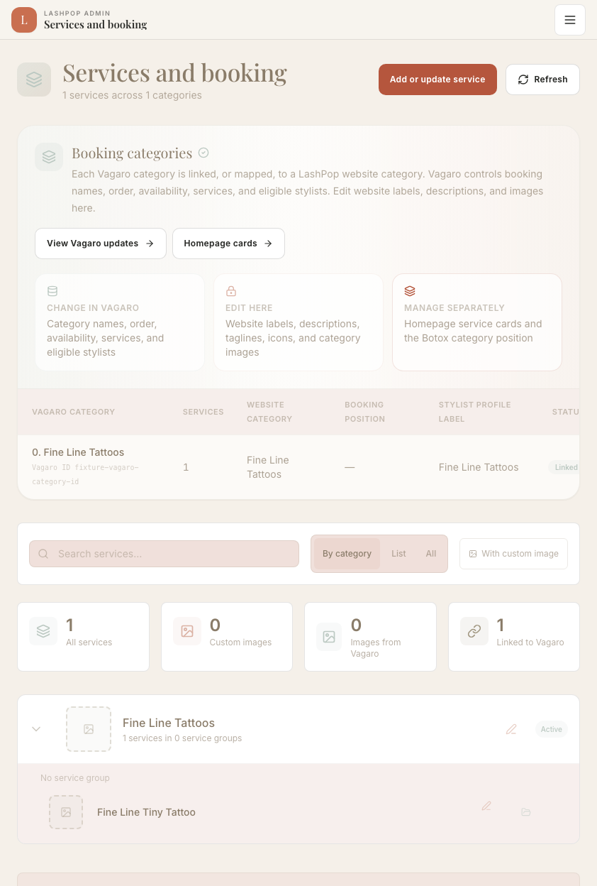

<!-- capability:homepage-service-cards -->
### Change homepage service cards

Control the service choices shown in the Choose a service section.

**Open:** Website → Homepage service cards

**Questions this guide answers**

- How do I add, edit, reorder, show, or hide a service card on the homepage?

#### Steps

1. **Open Homepage service cards.** Select Website, then Homepage service cards.
2. **Choose a card.** Edit its title, short line, description, icon or destination.
3. **Set the order and visibility.** Use the arrow controls to move it. Use the eye control to show or hide it.
4. **Save changes.** Select Save changes.
5. **Test every changed card.** Open the homepage and select each card you changed.

#### Check your work

- Cards appear in the intended order.
- Hidden cards do not appear.
- Every visible card opens the correct service.

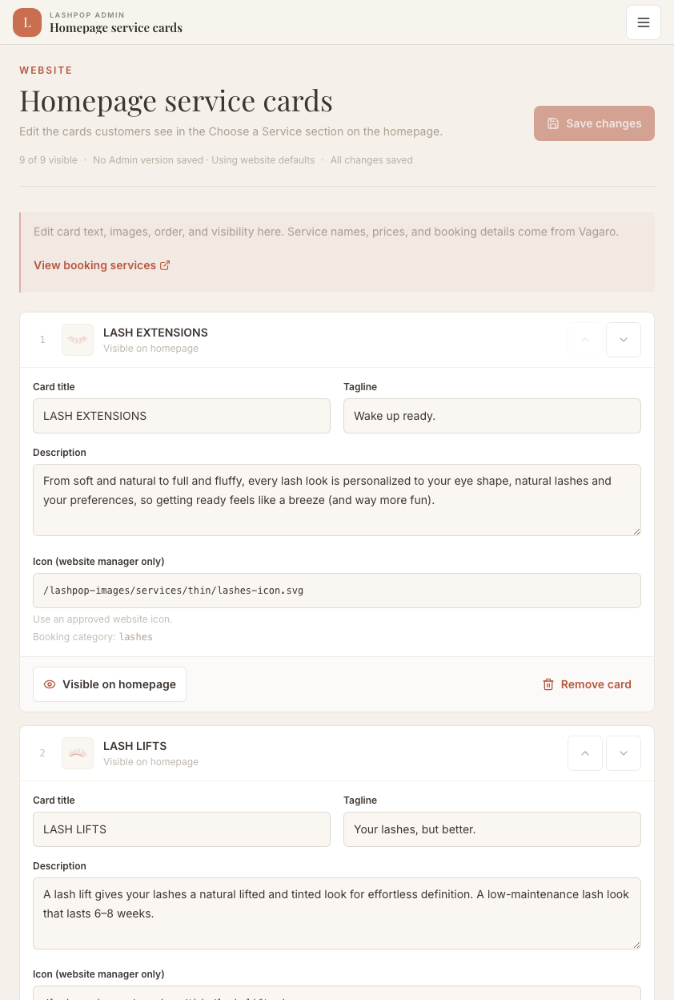

<!-- capability:team-stylists -->
### Add, update or publish a team member

Keep each profile accurate, choose who appears on the website and put the team in the right order.

**Open:** Website → Team and stylists

**Questions this guide answers**

- How do I add a new team member in Vagaro and publish them safely?
- How do I update a staff member?
- How do I sync a stylist from Vagaro?
- How do I show, hide, or reorder staff on the website?
- How do I update an external stylist's photo, bio, service tags, portfolio, quick facts, or credentials?

> **Before you continue:** Do not show a new profile until you have checked the public photo, services and booking path.

#### Before you start

- For a Vagaro team member, finish their profile and services in Vagaro first.
- Have approval for the public photo and biography.

#### Steps

1. **Set up a new Vagaro team member.** In Vagaro, add the employee profile, public photo, biography, services and prices. Turn on online booking. This step happens in Vagaro.
2. **Bring the latest profile into LashPop.** Open Team and stylists. Confirm the Vagaro work, then select Sync from Vagaro.
3. **Review the profile while it is hidden.** Check the photo, biography, services, contact details and booking link. New people stay hidden until you approve them.
4. **Add LashPop-only details.** Add portfolio photos, quick facts or credentials when needed. For someone who does not use Vagaro, you can also edit their main photo, biography and service labels here.
5. **Choose visibility and order.** Use the eye control to show or hide the person. Move cards into the order you want.
6. **Save and test.** Add a short reason when asked, save changes, then open the public team section and test the booking path.

#### Check your work

- The right people appear in the right order.
- Each visible profile has the approved photo and words.
- Services and booking match Vagaro.

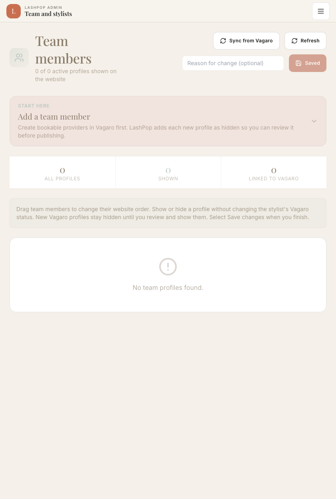

<!-- capability:founder-letter -->
### Update the founder letter

Change Emily's message on the homepage and review the full letter before saving.

**Open:** Website → Founder letter

**Questions this guide answers**

- How do I update the founder letter?

#### Steps

1. **Open Founder letter.** Select Website, then Founder letter.
2. **Edit the message.** Change the heading, greeting, paragraphs, sign-off or signature.
3. **Read the preview from start to finish.** Check names, paragraph order, punctuation and line breaks.
4. **Save and check the homepage.** Select Save. Open the homepage on a phone and computer.

#### Check your work

- The full message appears in the right order.
- No paragraph is missing or repeated.
- The signature looks correct on both screen sizes.

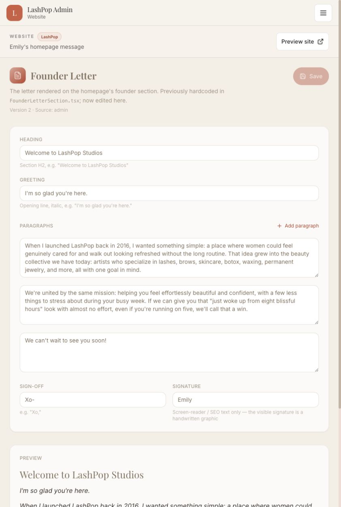

<!-- capability:founder-letter-redirect -->
### Use an old founder-letter link

The old link now opens the current Founder letter editor.

**Open:** Website → Founder letter

**Questions this guide answers**

- Where does the old founder-letter admin link take me?

#### Steps

1. **Open the old link.** Use the saved link as normal.
2. **Continue in the current editor.** LashPop sends you to Website, then Founder letter. There is only one current editor.
3. **Update your bookmark.** Save the new page if you keep Admin bookmarks.

#### Check your work

- The page title says Founder letter.
- You do not see two different editors.

<!-- capability:instagram -->
### Change the Instagram carousel

Choose how the homepage Instagram row behaves and refresh the saved posts.

**Open:** Website → Instagram

**Questions this guide answers**

- How do I control how many Instagram posts appear, whether captions show, and how the carousel moves?
- How do I refresh the Instagram posts already available in the media library?

#### Steps

1. **Open Instagram.** Select Website, then Instagram.
2. **Choose what people see.** Set the number of posts and choose whether captions appear.
3. **Choose how it moves.** Turn automatic movement on or off and set a comfortable speed.
4. **Add new Instagram photos.** Import the approved Instagram photos in Media, then select Refresh posts to update the photos available here.
5. **Save and watch the full row.** Save changes. Open the homepage and watch the carousel on a phone and computer.

#### Check your work

- The intended number of posts appears.
- Captions follow your setting.
- Movement is smooth and not distracting.

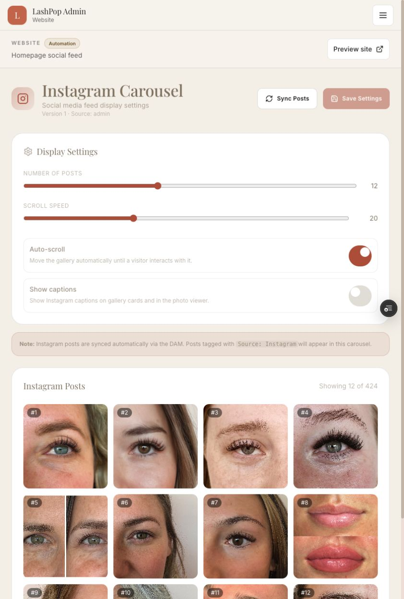

<!-- capability:faq -->
### Add or change a frequently asked question

Write clear answers, group related questions and choose what appears on the website.

**Open:** Website → FAQ

**Questions this guide answers**

- How do I add or change an FAQ?
- How do I organize FAQs into categories and choose which ones are visible or featured?

> **Before you continue:** Deleting removes the question. Hide it instead when you may need the wording or history later.

#### Steps

1. **Open FAQ.** Select Website, then FAQ.
2. **Choose a category.** Open the category that best matches the question. Add a category only when none fits.
3. **Add or edit the question.** Use the words a customer would use. Give the answer first, then add only the detail they need.
4. **Choose visibility.** Turn on Visible when the answer is ready. Use Featured only for the questions most customers need.
5. **Save and read it on the website.** Save the question. Open the public FAQ and read the answer on a phone.

#### Check your work

- The question is in the right category.
- The answer is short, clear and current.
- Visibility and Featured settings are correct.

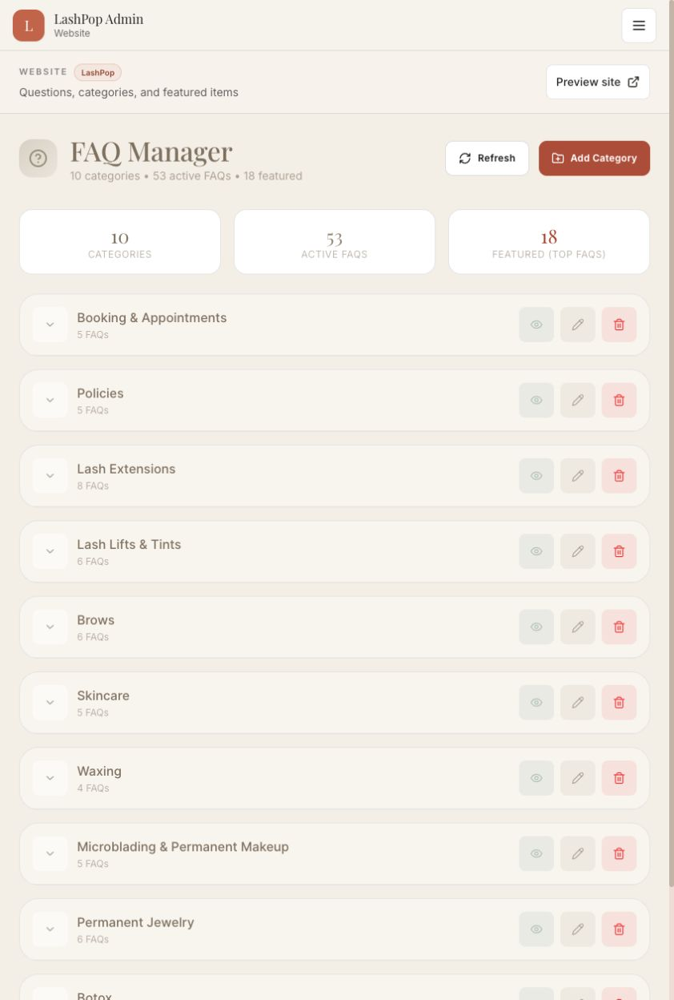

<!-- capability:quiz -->
### Change Find Your Look quiz photos or results

Manage the photos people compare and the result they see at the end.

**Open:** Website → Find Your Look

**Questions this guide answers**

- How do I add, crop, enable, or remove quiz comparison photos?
- How do I choose the photo and wording shown for each quiz result?

> **Before you continue:** Quiz changes affect the recommendation. Test all four styles before you finish.

#### Before you start

- Know which lash style each photo represents.
- Use the approved result photo and wording for each style.

#### Steps

1. **Open Find Your Look.** Select Website, then Find Your Look.
2. **Add and label comparison photos.** Upload the photo, choose the correct lash style and add a clear internal name.
3. **Set the crop.** Keep the whole eye and lash shape visible. Check the crop in every preview shape before saving.
4. **Choose which photos can appear.** Enable approved photos. Disable a photo instead of deleting it when you may need it later.
5. **Set each result.** Choose the final photo, heading and description for Classic, Hybrid, Volume and Wet/Angel.
6. **Test four clear paths.** Take the public quiz once for each style. Confirm the result and final photo match your choices.

#### Check your work

- Every photo has the correct style label.
- No eye edge is cut off.
- Each clear answer path gives the correct result and photo.

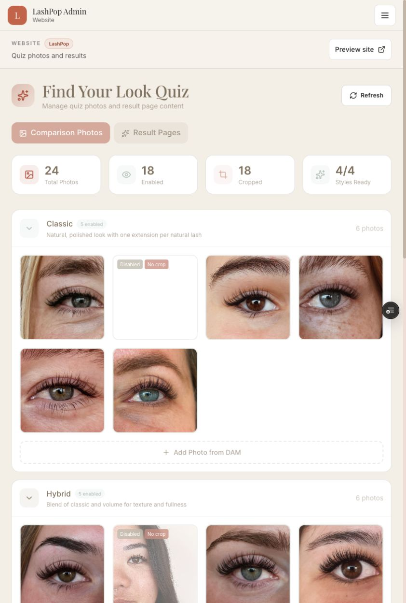

<!-- capability:work-with-us -->
### Change the Work With Us page

Update the page introduction, path summaries and photo carousel.

**Open:** Website → Work With Us

**Questions this guide answers**

- How do I update the Work With Us introduction and its employee, booth, and training summaries?
- How do I add, show, hide, or remove Work With Us photos?

> **Before you continue:** Benefits, prices, forms and policy wording need a reviewed website change. Do not promise new terms in the summary fields.

#### Steps

1. **Open Work With Us.** Select Website, then Work With Us.
2. **Update the introduction.** Explain who LashPop is looking for and what someone should do next.
3. **Review the three paths.** Update the short summaries for employee, booth rental and training. Do not change benefits, prices or policy promises here.
4. **Manage the photos.** Add approved photos, choose what appears, change the order or hide an image.
5. **Save and check the page.** Open the public page on a phone and computer. Read every path and watch the full photo row.

#### Check your work

- The introduction and three summaries are current.
- Photos load in the intended order.
- Application buttons still open the correct form.

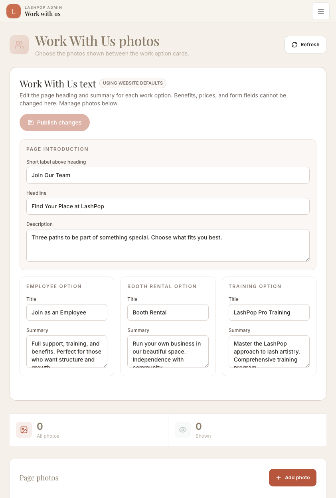

<!-- capability:search-sharing -->
### Change search and social-share wording

Update page titles, descriptions and share images without changing the visible page copy.

**Open:** Website → Search and sharing

**Questions this guide answers**

- How do I update the words and images people see in Google results and social shares?

#### Steps

1. **Open Search and sharing.** Select Website, then Search and sharing.
2. **Choose the page.** Open the page whose search or share preview you want to change.
3. **Write the title and description.** Say what the page offers in plain language. Put the most useful words first.
4. **Choose the share image.** Use an approved image that stays clear when cropped wide.
5. **Save and preview.** Save the settings. Use the preview to check for cut-off words or images.

#### Check your work

- The title names the page clearly.
- The description is accurate and not repetitive.
- The share image has no important detail near the edge.

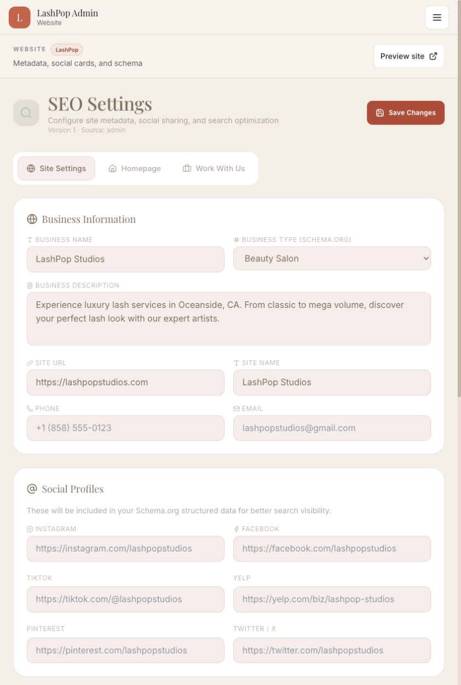

## Reviews

<!-- capability:reviews -->
### Choose and correct website reviews

Choose the reviews people see and lock an approved correction when the automatic choice is wrong.

**Open:** Reviews and reputation → Review library

**Questions this guide answers**

- How do I choose and reorder the reviews shown on the homepage?
- How do I correct a review's website visibility, stylist, score, or editor notes without automation overwriting it?

> **Before you continue:** A locked correction will not update automatically. Unlock it when the correction is no longer needed.

#### Steps

1. **Open Review library.** Select Reviews and reputation, then Review library.
2. **Find the review.** Search by customer or words in the review, or filter by review source.
3. **Choose homepage reviews.** Add or remove the review from the homepage and place chosen reviews in the order you want.
4. **Correct a wrong detail.** Open the review. Change visibility, stylist, score or notes only when you have checked the source.
5. **Save the approved correction.** Select Save changes. Fields you change become manually set, so automatic updates leave them alone until you unlock them.

#### Check your work

- The intended reviews appear on the homepage.
- Names and stylist links are correct.
- Only approved corrections are locked.

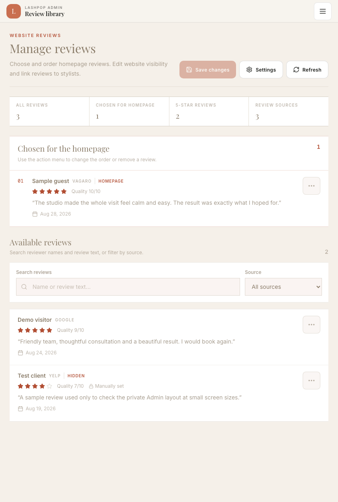

<!-- capability:review-automation -->
### Change automatic review choices

Control how LashPop scores reviews and refreshes the automatic homepage selection.

**Open:** Reviews and reputation → Automation

**Questions this guide answers**

- How do I change the rules that score and rotate reviews?

> **Before you continue:** These settings can change many reviews at once. Make small changes and check the result.

#### Before you start

- Know the result you want and which reviews would be affected.
- Record the current settings before changing them.

#### Steps

1. **Open Automation.** Select Reviews and reputation, then Automation.
2. **Change one rule at a time.** Adjust the score or rotation setting you need. Leave unrelated settings alone.
3. **Save the settings.** Review the numbers once more, then select Save.
4. **Check the next result.** Review the homepage choices after the next automatic update.

#### Check your work

- The saved values match what you intended.
- Pinned reviews stay in place.
- The automatic selection still contains suitable reviews.

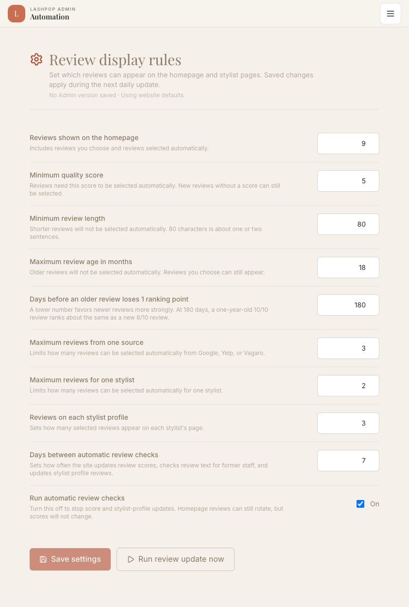

## Media

<!-- capability:media-library -->
### Upload and organize website media

Keep approved photos and videos easy to find, understand and reuse.

**Open:** Media → Media library

**Questions this guide answers**

- How do I upload photos or videos?
- How do I search, filter, tag, describe, group, or assign media for reuse around the website?

> **Before you continue:** Deleting a media item can remove it from several places. Check its assignments first.

#### Before you start

- Use the original high-quality file.
- Confirm you have permission to use it on the website.

#### Steps

1. **Open Media library.** Select Media, then Media library.
2. **Upload the files.** Select Upload files and choose the approved photos or videos. Wait for every upload to finish.
3. **Add a useful description.** Open each item. Add alt text that describes the image for someone who cannot see it. Add a caption only when a website section needs one.
4. **Make it easy to find.** Add the right person, service, tag or collection. Use words the team will search for later.
5. **Check the file.** Open the large preview. Make sure it is sharp, upright and the intended file.

#### Check your work

- The file opens without an error.
- Alt text explains the important content.
- Search and filters can find the item.

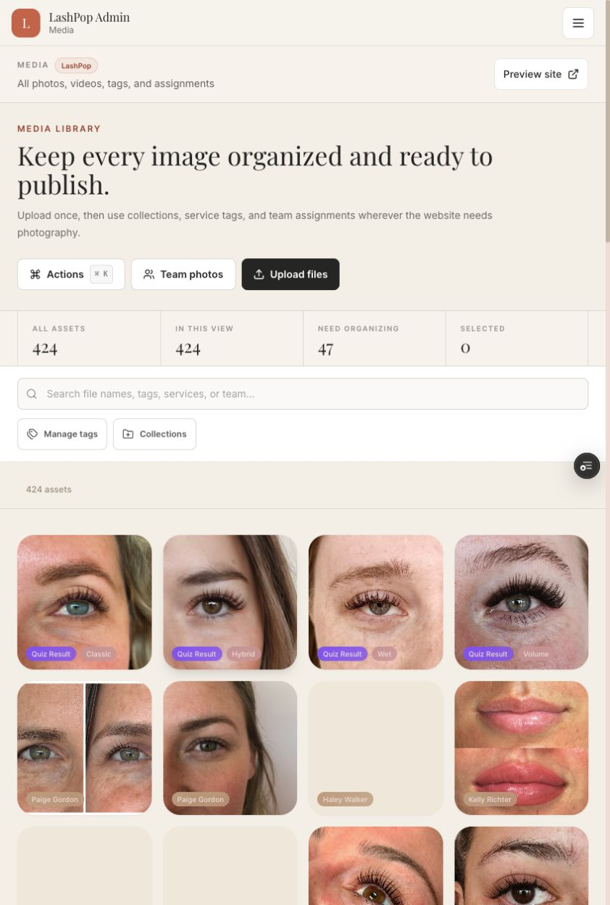

<!-- capability:team-photography -->
### Manage a team member's portrait and album

See the photo used on the website and prepare uploaded photos and crops for each team member.

**Open:** Media → Team photography

**Questions this guide answers**

- How do I upload, crop, choose the primary photo, or manage the photo album for a team member?

#### Steps

1. **Open Team photography.** Select Media, then Team photography.
2. **Choose the person.** The card shows the portrait currently used on the website. Select the person to open their photo library.
3. **Upload an approved source photo.** Select Upload photos and choose the original file.
4. **Set every crop.** Open Set crops. Keep the face and important details inside each preview shape, then save all crops.
5. **Choose the primary upload.** Select Make primary on the prepared photo. If the profile comes from Vagaro, the page tells you that the website still uses the Vagaro photo.
6. **Check the website photo.** Compare the Website photo panel with the public team card.

#### Check your work

- The website photo matches the public team card.
- The primary uploaded file opens.
- All crop previews keep the face inside the frame.

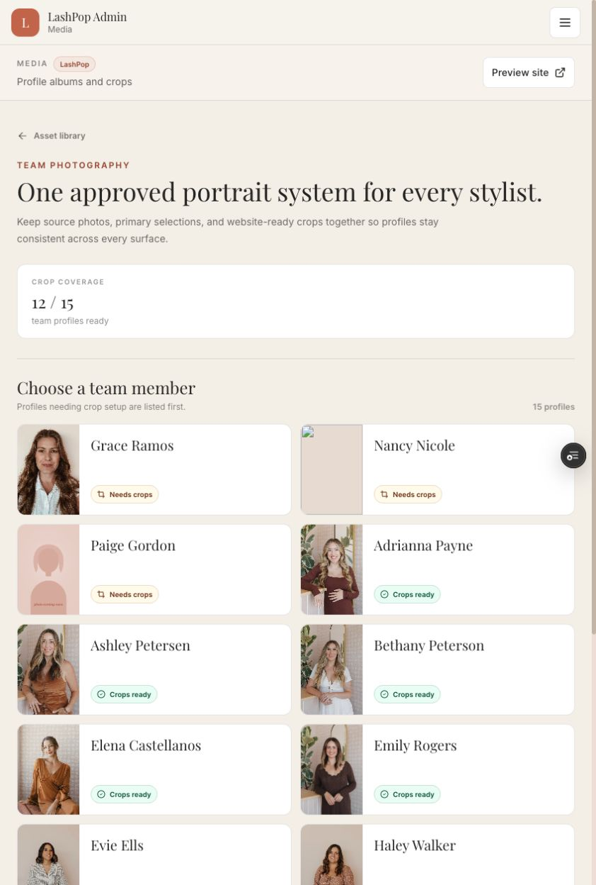

## Inbox

<!-- capability:inbox-overview -->
### See new signups and applications

Use one page to see new people who have signed up or applied.

**Open:** Inbox → Inbox overview

**Questions this guide answers**

- Where do I see new newsletter signups and Work With Us applications?

#### Steps

1. **Open Inbox.** Select Inbox, then Inbox overview.
2. **Check the totals.** Review newsletter signups and Work With Us applications.
3. **Open a list.** Select the card for the people you need to review.
4. **Handle the oldest new item first.** Work through new records in date order unless one is urgent.

#### Check your work

- You have opened every new item.
- You have not copied or contacted anyone without a clear reason.

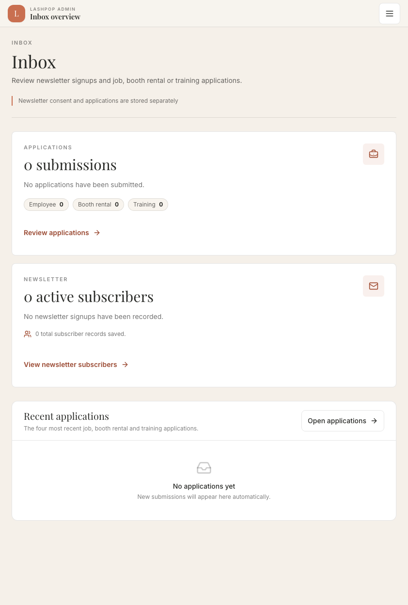

<!-- capability:newsletter -->
### Find and manage newsletter subscribers

Search the consent list, export active subscribers and keep an accurate history when a status changes.

**Open:** Inbox → Newsletter subscribers

**Questions this guide answers**

- How do I find a newsletter subscriber and understand their consent status?
- How do I copy or export only active subscribers?
- How do I mark a subscriber active, unsubscribed, or suppressed without erasing history?

> **Before you continue:** Never add an unsubscribed or suppressed person back to a marketing list without new consent.

#### Steps

1. **Open Newsletter subscribers.** Select Inbox, then Newsletter subscribers.
2. **Find the person.** Search by email address or use the status filter.
3. **Read the consent history.** Check when and how the person signed up before changing anything.
4. **Change status without deleting.** Use Active, Unsubscribed or Suppressed. Keep the record so LashPop retains the consent history.
5. **Copy or export active subscribers.** Choose the active-only copy or export control. Check the active filter before using the list.

#### Check your work

- Only active subscribers are included in a marketing list.
- Unsubscribed and suppressed people remain excluded.
- The history record still exists.

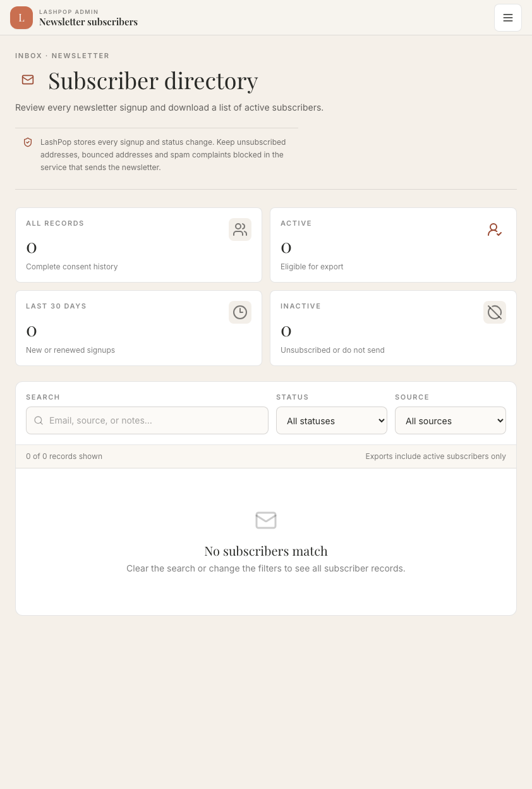

<!-- capability:applications -->
### Read a Work With Us application

Review an applicant's submitted answers and contact details in one place.

**Open:** Inbox → Applications

**Questions this guide answers**

- How do I read the details and contact information from a Work With Us application?

> **Before you continue:** Applications contain private information. Do not download, forward or copy details unless the work requires it.

#### Steps

1. **Open Applications.** Select Inbox, then Applications.
2. **Choose an application.** Use the date and application type to find the person you need.
3. **Read the full submission.** Review their contact details, experience, interests and answers before taking notes elsewhere.
4. **Use the approved contact process.** Contact the person only when LashPop has decided who should respond and how.

#### Check your work

- You reviewed the complete application.
- Contact details were not shared outside the people who need them.

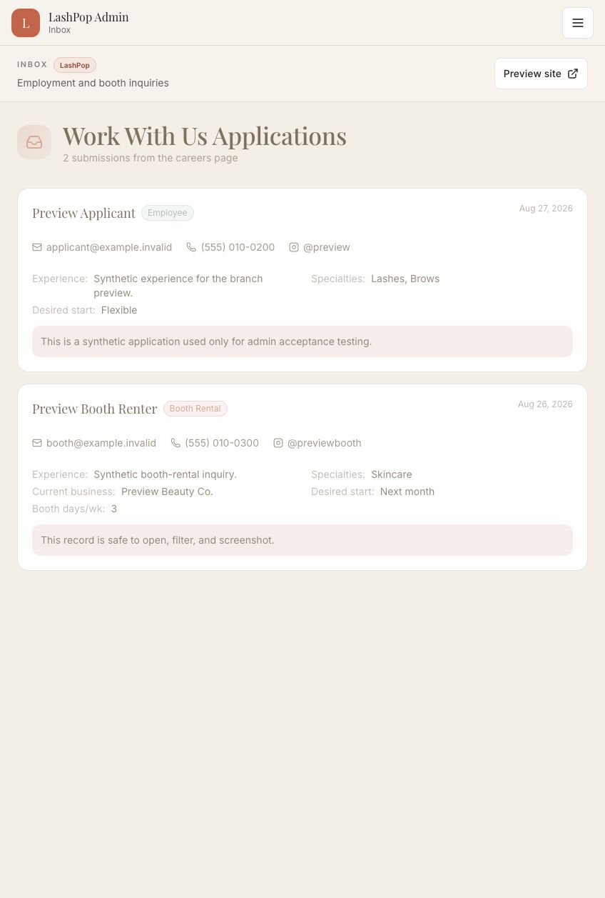

## Settings

<!-- capability:settings-overview -->
### Check your access and latest Vagaro update

See what your Admin role allows and whether the latest Vagaro update completed.

**Open:** Settings → Settings overview

**Questions this guide answers**

- Where do I check my access level and the latest Vagaro sync?

#### Steps

1. **Open Settings.** Select Settings, then Settings overview.
2. **Check your role.** Your role appears in the Access card. Owner, Publisher and Viewer have different permissions.
3. **Check the latest Vagaro update.** Read the time and status. Open Vagaro sync when you see a warning.
4. **Open the setting you need.** Use the cards to manage access, updates or history.

#### Check your work

- Your role matches what you expect.
- The latest Vagaro update completed, or you opened Vagaro sync to review the failure.

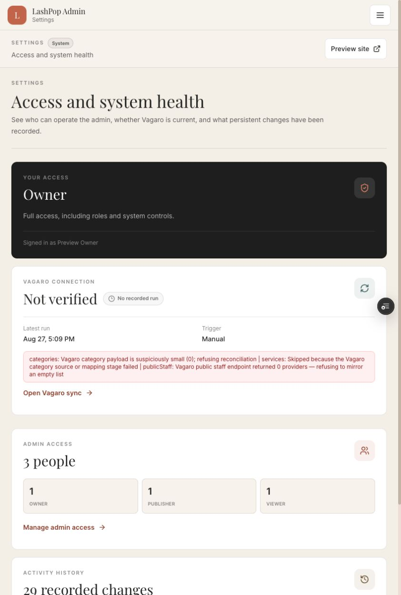

<!-- capability:admin-access -->
### Give or remove Admin access

Choose the lowest level of access a person needs and remove access when they no longer need it.

**Open:** Settings → Admin access

**Questions this guide answers**

- How do I give someone owner, publisher, viewer, or no admin access?

> **Before you continue:** Owner access can change everything in Admin. Give it only to people who need full control.

#### Before you start

- Confirm the person's identity and why they need access.
- Only an Owner can change Admin access.

#### Steps

1. **Open Admin access.** Select Settings, then Admin access.
2. **Find the person.** Search carefully and confirm the phone number or email belongs to the intended person.
3. **Choose the role.** Use Viewer for read-only access, Publisher for approved content changes and Owner only for full control.
4. **Save and confirm.** Save the change. Ask the person to sign in and confirm they see the right tools.
5. **Remove access when it ends.** Choose No admin access when the person no longer needs the Admin panel.

#### Check your work

- The correct person has the correct role.
- Nobody has more access than their work requires.

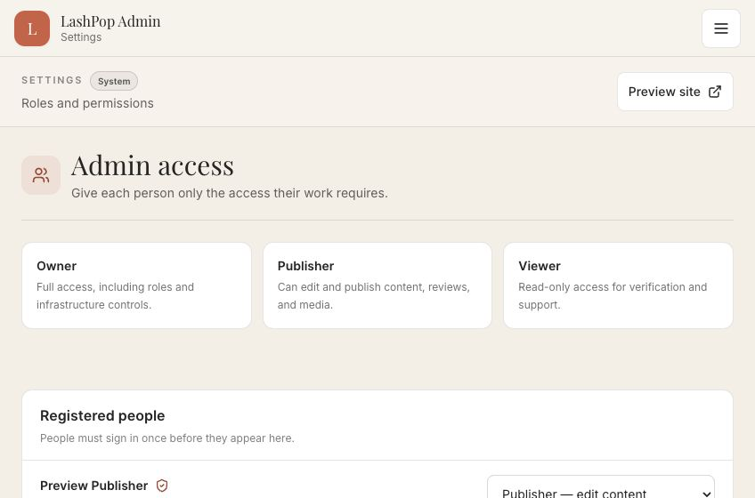

<!-- capability:vagaro-sync -->
### Check or run the Vagaro update

Check when Vagaro last updated LashPop and run it again after an important Vagaro change.

**Open:** Settings → Vagaro sync

**Questions this guide answers**

- How do I check Vagaro categories, services, team members and booking links?
- How do I run a Vagaro sync now?
- How often does Vagaro sync, what does it update, and when should I run it manually?

> **Before you continue:** Finish the Vagaro changes before running the update. An incomplete Vagaro setup can bring incomplete details into LashPop.

#### Steps

1. **Open Vagaro sync.** Select Settings, then Vagaro sync.
2. **Read the latest status.** Check categories, services, team members and stylist service links. If a step failed, use its name to check the matching Vagaro details before running the sync again.
3. **Know when it runs.** Vagaro sync runs three times a day. During daylight saving time it starts at 11 p.m., 7 a.m. and 3 p.m. Pacific. During standard time it starts at 10 p.m., 6 a.m. and 2 p.m. Pacific.
4. **Run it after an important change.** Use Sync from Vagaro now after you finish a service, price, availability or staff change in Vagaro.
5. **Wait for every part to finish.** Do not close the page while the update is running. Read any warning before publishing.

#### Check your work

- Every update part says it completed.
- Visible services have a working booking connection.
- New people and services remain hidden until reviewed.

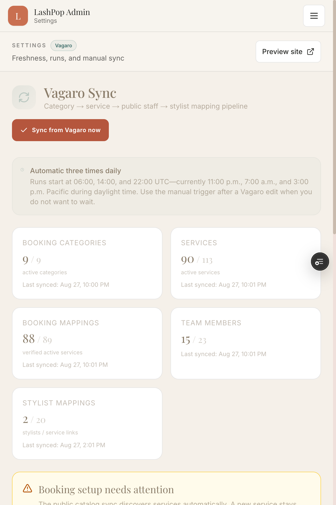

<!-- capability:activity-history -->
### Review Admin activity

Use Activity history to see recorded changes, requests and attempts, who made them and when.

**Open:** Settings → Activity history

**Questions this guide answers**

- How do I see what happened in Admin?

#### Steps

1. **Open Activity history.** Select Settings, then Activity history.
2. **Find the activity.** Use the date, person and action to find the right entry.
3. **Read the entry.** Check the recorded action and affected item before trying to undo anything.
4. **Use the right recovery page.** If you need to undo website settings, open Website versions. For other changes, confirm the safest next step before editing.

#### Check your work

- You found the correct activity.
- You understand the recorded action before trying to undo it.

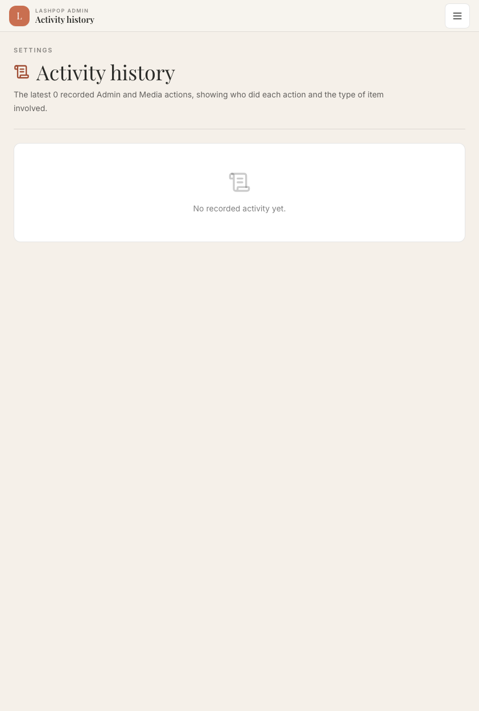

<!-- capability:website-history -->
### Restore an older website version

Review an older saved version and restore it as a new version so the full history remains available.

**Open:** Settings → Website versions

**Questions this guide answers**

- How do I find an older saved website version and restore it without erasing history?

> **Before you continue:** Restore changes the website. Compare the version carefully and check the public page straight away.

#### Before you start

- Know which website section changed and roughly when.
- Check Activity history first when you are unsure what happened.

#### Steps

1. **Open Website versions.** Select Settings, then Website versions.
2. **Find the last correct version.** Use the section name, date, person and version number. Check Activity history if you are not sure which version was correct.
3. **Select Restore.** Read the confirmation, then restore only when you are certain.
4. **Check the website.** Open the affected page on a phone and computer. The restored values are saved as a new version.

#### Check your work

- The intended values are live.
- The earlier and restored versions both remain in history.

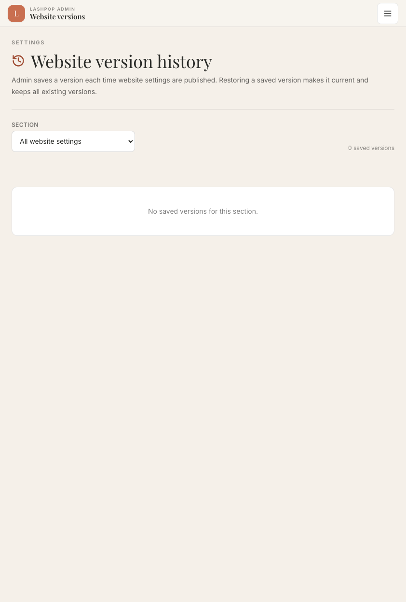

## If something looks wrong

Stop before saving another change. Check Activity history to see what changed. Use Website versions only when you have found and checked the last correct version.

For booking, price, availability or staff-service problems, check Vagaro first. For a new booking connection, contact the website manager and keep the item hidden until they confirm it is ready.
